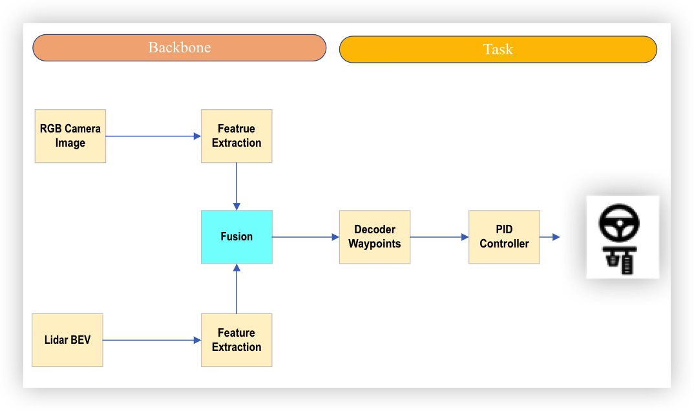
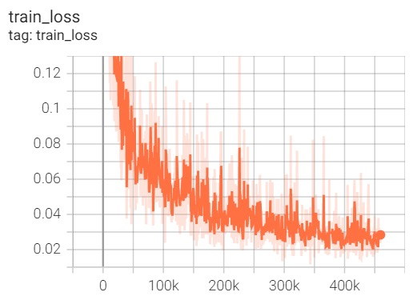
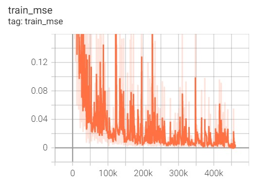
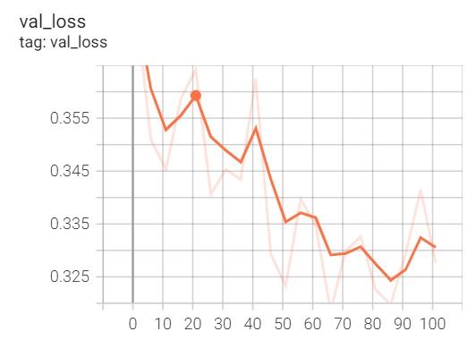
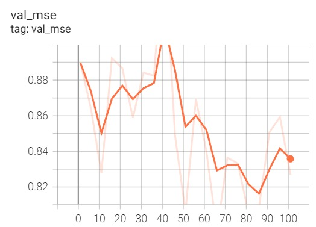

# AutoDrive

## Introduction



In this project, the author designs and implements five enhanced versions of Transfuser with different fusion methods. These successful or failed models are detailed in the table below:

|  Model   | Params (M)  | FLOPS (M)  |
|  :----  | :----:  | :----:  |
| TransFuserBifusion  | 72.64 | 9666.78 |
| TransFuserEBiFusion  | 72.76  | 9666.88  |
| TransFuserPentaFusion  | 73.81  | 9734.02  |
| TransFuserPentaFusionEPool  | 73.81  | 15000.20  |
| **TransFuserPentaFusionSE**  | **73.90**  | **9734.24**  |


## Training

### 1. Download dataset

Please run the following command to download the dataset required for your training.

```Shell
chmod +x download_data.sh
./download_data.sh
```

This project provides the two versions of the dataset used:

- Dataset ID: 0 - Minimal dataset (63G), contains only rgb_front, lidar and measurements from the 14_weathers_data. This is sufficient to train all the models (except LBC which also requires topdown).
- Dataset ID: 1 - Large scale dataset (406G): contains multi-view camera data with different perception labels and affordances for both clear_weather_data and 14_weathers_data to facilitate further development of imitation learning agents.

### 2. Configure the environment

Here, the author recommends using Conda to create the python3.7 virtual environment required for training and validation. Then, use pip to install the required dependencies.

```Shell
conda create -n autodrive python=3.7
conda activate autodrive
pip install -r requirements.txt
```

### 3. Start training

Enter the directory of the transfuer_XXX model to be trained and run the training script.

```Shell
cd transfuer_XXX
CUDA_VISIBLE_DEVICES=<gpu_id> python train.py --id transfuser_XXX
```

It should be noted that users should modify the model hyperparameters in config.py according to their own needs. The author recommends using the default parameters in config.py.

### 4. Report the results





## Evaluation

After the model is trained, the log/transfuer_XXX folder will be generated in the folder where it is located, which contains the model parameter files model_X.pth and best_model.pth files saved in each iteration during the model training process. 

To verify the feasibility of the trained model, we simulated an autonomous driving scenario on Carla and used the leaderboard to interact. Follow the steps below to deploy and verify.

### 1. Install and start Carla Server

```Shell
wget https://carla-releases.s3.eu-west-3.amazonaws.com/Linux/CARLA_0.9.10.tar.gz
tar -xzf CARLA.tar.gz -C CARLA
rm CARLA.tar.gz
cd CARLA/
./CarlaUE4.sh
```

### 2. Run the Autopilot

Once the CARLA server is running, rollout the autopilot to start data generation.

```Shell
cd ..
./leaderboard/scripts/run_evaluation.sh
```

Note: Before running the above command, please update ```leaderboard/scripts/run_evaluation.sh``` to include the following.

```bash
export ROUTES=leaderboard/data/evaluation_routes/routes_town05_long.xml
export TEAM_AGENT=leaderboard/team_code/transfuser_XXX_agent.py
export TEAM_CONFIG=transfuser_XXX/log/transfuser_XXX/best_model.pth
export CHECKPOINT_ENDPOINT=results/transfuser_XXX_result.json
export SCENARIOS=leaderboard/data/scenarios/town05_all_scenarios.json
```
### 3. Report the results

|  Model   | Score Composed  | Score Route  | Score Penalty  |
|  :----  | :----:  | :----:  | :----:  |
| TransFuser  | 40.72 | 73.25 | 0.64 |
| TransFuserBifusion  | - | - | - |
| TransFuserEBiFusion  | -  | -  | - |
| TransFuserPentaFusion  | **53.12**  | **88.23**  | 0.61 |
| TransFuserPentaFusionEPool  | 40.07  | 54.29  | 0.79 |
| TransFuserPentaFusionSE  | 44.73  | 87.80  | **0.52** |

- Score Composed: Driving Score (DS), which is route completion weighted
by an infraction multiplier

- Score Route: Route Completion
(RC), percentage of route distance completed

- Score Penalty: An infraction multiplier that accounts for collisions with pedestrians, vehicles, and static elements, route deviations,
lane infractions, running red lights, and running stop signs


